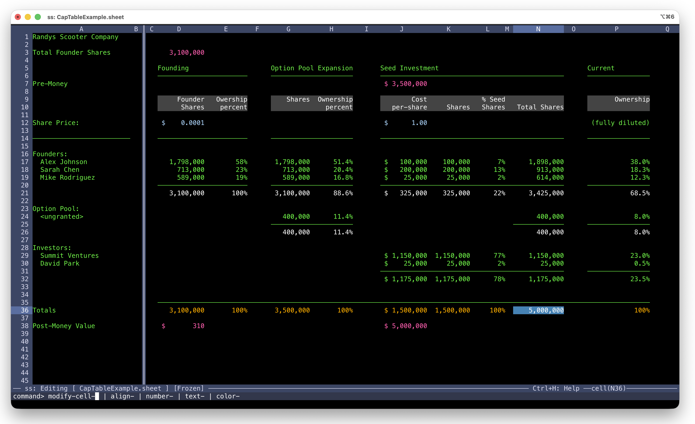
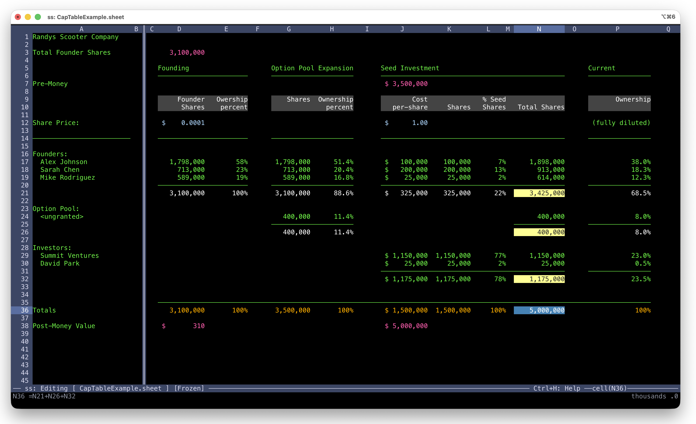
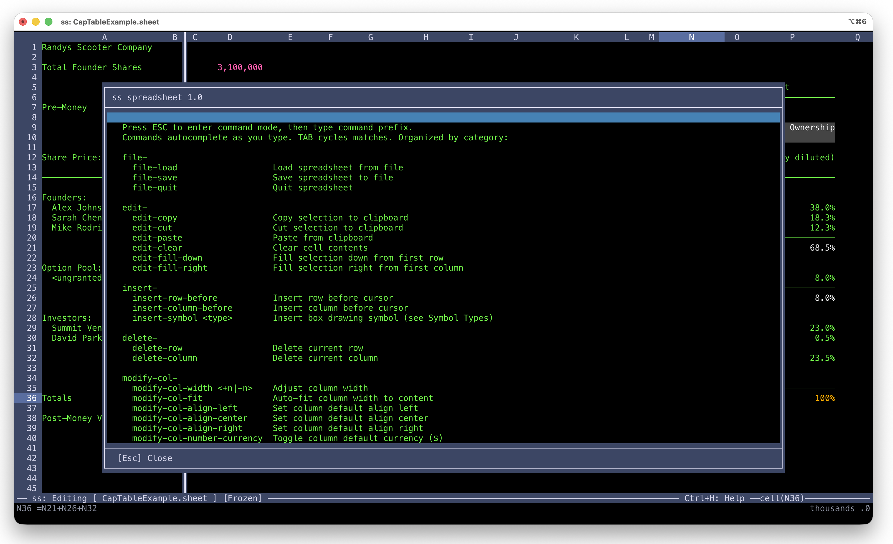

# ss

A terminal-based spreadsheet. Zero dependencies. Formulas, formatting, freeze panes, box drawing—all from your terminal.



## Why ss?

Terminal spreadsheets tend to be either too minimal (no formulas, no formatting) or too heavy (curses dependencies, complex builds). ss sits in the middle: a real spreadsheet with formulas, cell formatting, currency and date types, freeze panes, and UTF-8 box drawing—built with zero external dependencies.

Like its companion editor [cmacs](https://github.com/toddvernon/cm), ss is written in C++ with no STL, no Boost, no autoconf. Just `make`. It builds on macOS and Linux.

**What you get:**

- **Formulas** — Cell references, absolute/relative addressing, range functions like SUM
- **Tab-completed commands** — Press ESC and type. Commands auto-complete and auto-execute in 2-3 keystrokes.
- **Cell formatting** — Currency, percentages, decimal places, alignment, date formats, colors
- **Freeze panes** — Lock header rows and columns while scrolling
- **Box drawing** — UTF-8 line-drawing symbols that adapt to cell width
- **JSON file format** — Human-readable `.sheet` files



## Design Philosophy

ss is a spiritual companion to [cmacs](https://github.com/toddvernon/cm). Both share the same architecture: a self-contained C++ codebase built on the [cx library](https://github.com/toddvernon/cx), avoiding the C++ Standard Library entirely. The result is fast, portable, and has zero runtime dependencies beyond a terminal.

Data entry is direct—just start typing into any cell. The first character determines the mode: letters for text, digits for numbers, `$` for currency, `=` for formulas. No mode switching required.

## Getting Started

ss depends on the [cx library](https://github.com/toddvernon/cx), which must be cloned alongside it in a specific directory structure:

```
cx/
├── cx/              <- cx library
├── cx_apps/
│   └── ss/          <- this repo
└── lib/             <- built libraries (created by make)
```

### Clone and Build

```bash
# Create the directory structure
mkdir -p ~/dev/cx/cx_apps
cd ~/dev/cx

# Clone the cx library
git clone https://github.com/toddvernon/cx.git

# Clone ss
cd cx_apps
git clone https://github.com/toddvernon/ss.git

# Build the cx library first
cd ~/dev/cx/cx
make

# Build ss
cd ~/dev/cx/cx_apps/ss
make
```

That's it. No configure scripts, no dependency resolution, no package managers. If `make` works on your system, you're done.

### If Something Goes Wrong

- **Missing headers?** Make sure you cloned into the right directory structure. The makefile expects `cx/` to be two levels up.
- **Linker errors?** Build the cx library first (`cd ~/dev/cx/cx && make`).

## Building

ss builds with a simple makefile. No autoconf, no cmake, no package managers.

```bash
make
```

To install to `/usr/local/bin`:

```bash
make install
```

To install the help file to `/usr/local/share/ss`:

```bash
make install-help
```

Or install everything at once:

```bash
make install-all
```

### Supported Platforms

- macOS (ARM64 and x86_64)
- Linux (x86_64)

### Dependencies

None beyond a C++ compiler and standard POSIX headers. The cx library provides all string handling, screen management, keyboard input, expression evaluation, and the spreadsheet data model.

## Usage

```bash
ss [filename.sheet]
```

Just start typing to enter data in the current cell. The first character determines the entry mode:

| First character | Mode |
|-----------------|------|
| Letter | Text |
| Digit, `+`, `-` | Number |
| `$` | Currency ($1,234.56) |
| `=` | Formula (e.g., =A1+B2) |
| `@` | Textmap (conditional text labels) |

Press **Enter** to commit, **ESC** to cancel.

First thing to try: press `Ctrl+H` for the built-in help.



## Key Bindings

### Navigation

| Key | Action |
|-----|--------|
| Arrow keys | Move between cells |
| Shift+Arrow | Select range |
| Ctrl+Arrow | Jump to edge of data region |
| Page Up/Down | Scroll by screen |
| Home | Move to column A |

### Formatting Shortcuts

| Key | Action |
|-----|--------|
| Ctrl+N / Ctrl+4 | Cycle number formats |
| Ctrl+5 | Toggle percent format |
| Ctrl+A | Cycle alignment |
| Ctrl+D | Cycle date formats |

### Clipboard

| Key | Action |
|-----|--------|
| Ctrl+K | Copy selection |
| Ctrl+Y | Paste |
| Delete/Backspace | Clear selection |

### File Operations

| Key | Action |
|-----|--------|
| Ctrl+X Ctrl+S | Save |
| Ctrl+X Ctrl+C | Quit |

## ESC Commands

Press ESC to open the command prompt, then type. Each keystroke narrows the matches, the shared prefix fills in automatically, and when your input uniquely identifies a command it executes immediately. Most commands take 2-3 keystrokes.

### file-
| Command | Description |
|---------|-------------|
| file-load | Load spreadsheet from file |
| file-save | Save spreadsheet |
| file-quit | Quit |

### edit-
| Command | Description |
|---------|-------------|
| edit-copy | Copy selection |
| edit-cut | Cut selection |
| edit-paste | Paste from clipboard |
| edit-clear | Clear cell contents |
| edit-fill-down | Fill selection down from first row |
| edit-fill-right | Fill selection right from first column |

### insert-
| Command | Description |
|---------|-------------|
| insert-row-before | Insert row before cursor |
| insert-column-before | Insert column before cursor |
| insert-symbol \<type\> | Insert box drawing symbol |

### delete-
| Command | Description |
|---------|-------------|
| delete-row | Delete current row |
| delete-column | Delete current column |

### modify-col-
| Command | Description |
|---------|-------------|
| modify-col-width \<+n\|-n\> | Adjust column width |
| modify-col-fit | Auto-fit column width to content |
| modify-col-align-left/center/right | Set column alignment |
| modify-col-number-currency | Toggle currency format |
| modify-col-number-decimal \<n\> | Set decimal places |
| modify-col-number-percent | Toggle percent format |
| modify-col-number-thousands | Toggle thousands separators |
| modify-col-color-foreground/background | Set column colors |
| modify-col-hide / modify-col-show | Hide/show columns |

### modify-cell-
| Command | Description |
|---------|-------------|
| modify-cell-align-left/center/right | Set cell alignment |
| modify-cell-number-currency | Toggle currency format |
| modify-cell-number-decimal \<n\> | Set decimal places |
| modify-cell-number-percent | Toggle percent format |
| modify-cell-number-thousands | Toggle thousands separators |
| modify-cell-text-wide | Toggle wide text spacing |
| modify-cell-color-foreground/background | Set cell colors |

### view-
| Command | Description |
|---------|-------------|
| view-freeze | Freeze rows/columns (selection must start at A1) |
| view-unfreeze | Remove freeze panes |

## Formulas

ss supports cell references, absolute/relative addressing, and range functions:

```
=A1+B2              Cell references
=SUM(A1:A10)        Range functions
=$A$1               Absolute reference
=A$1 or =$A1        Mixed reference
```

In formula mode, press TAB or Up/Down arrow to enter **cell hunt mode**: navigate with arrow keys to select cell references visually, Shift+Arrow to select a range, Enter to confirm. Range selections auto-insert a closing parenthesis.

## Help

Press `Ctrl+H` to view the built-in help, or see `ss_help.md` for the full reference.

## License

Apache License 2.0. See LICENSE file.
